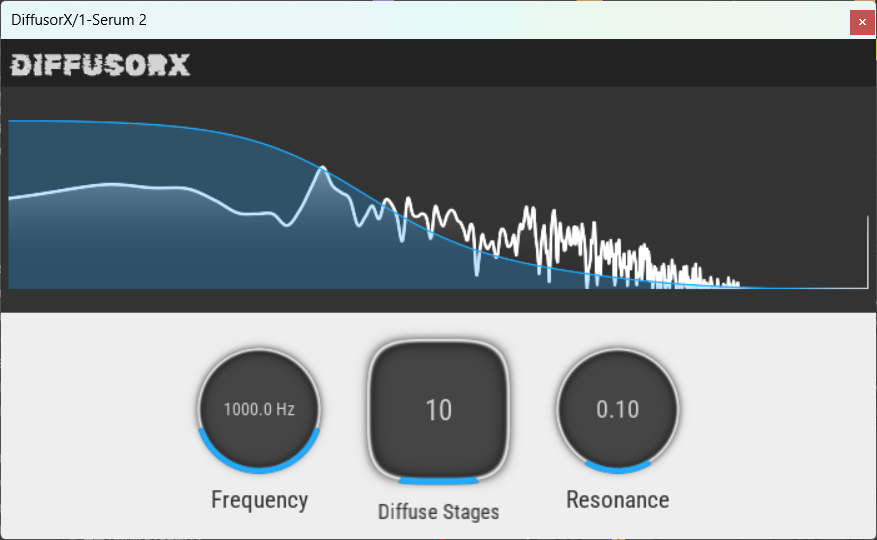

# DiffusorX
[](https://github.com/Snipet/DiffusorX/actions/workflows/build_windows.yml)

A modern frequency diffusion plugin built off of JUCE and Visage.

## Building
1. Clone this repo and its submodules
2. ```mkdir build && cd build```
3. ```cmake ..```
4. ```cmake --build .``` or ```cmake --build . --config Release```

This plugin has only been tested on Windows.

## Motivation
This plugin is essentially just a bunch of cascaded allpass filters. In my opinion, synth basses and drum oneshots sound cool when they their lower frequencies are delayed. This gives snare and kicks a "snappy" sound, and it makes synth basses stand out in a mix. I especially like distorting synth basses after I delay certain frequencies (try using a saturation plugin after this one).

## Submitting Issues
This project is actively being worked on. If you find any bugs (especially ones not on Windows), please don't hesitate to submit an issue on GitHub. As of writing, I have not tested this plugin on MacOS or Linux (both which I plan to support).

